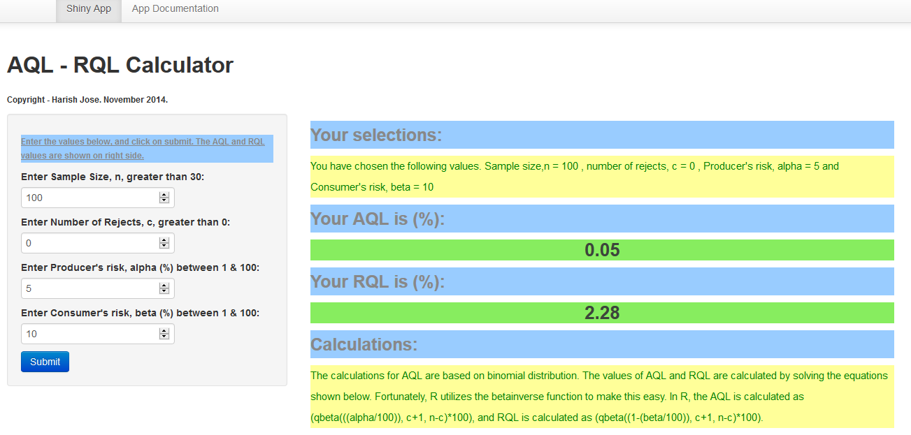

<style>
.small-code pre code {
  font-size: 1em;
}
</style>
AQL-RQL (Slide 1)
========================================================
author: Harish Jose
date: November 2014
Thank you for your time!

I have 5 slides to describe my app, and the last slide contains the R code.

What is the App? (Slide 2)
========================================================

The app I developed as part of the Developing Data Products is called as AQL-RQL Calculator.

Everybody involved in Quality Engineering/Quality Control field has had some form of exposure to Acceptance Sampling. This app allows the user to enter the sample size and number of rejects, and based on the alpha and beta values chosen, the app will calculate the AQL and RQL values.

- AQL : Acceptable Quality Level. We can call AQL as the worst case scenario quality level for the producer.
- RQL : Rejectable Quality Level. We can call AQL as the worst case scenario quality level for the Consumer.

What does the App look like? (Slide 3)
========================================================



4 inputs needed for the App? (Slide 4)
========================================================
- Sample size (n) : This is the number of units that we are going to inspect out of the incoming lot.
- Number of Rejects ( c ) : This is the maximum number of rejects that we can tolerate in the sample size we inspect. Generally, this is zero.
- Alpha : This is also called as Producer's risk and we generally use 5% as the alpha value.
- Beta : This is also called as Consumer's risk and we generally use 10% as the beta value.

The App opens with sample size = 100, number of rejects = 0, alpha = 5% and beta = 10%. Of course the user can enter thei desired values. After this, click on Submit to get the AQL and RQL values.

Slide With Code (Slide 5)
========================================================
class: small-code
In R, the AQL is calculated as (qbeta(((alpha/100)), c+1, n-c)*100), and RQL is calculated as (qbeta((1-(beta/100)), c+1, n-c)*100).The example R code using the default values of n=100, c=0, alpha = 5 and beta = 10 is shown below. 

```r
AQL<-round((qbeta(((5/100)), 0+1, 100-0)*100),2)
RQL<-round((qbeta((1-(10/100)), 0+1, 100-0)*100),2)
AQL
```

```
[1] 0.05
```

```r
RQL
```

```
[1] 2.28
```


